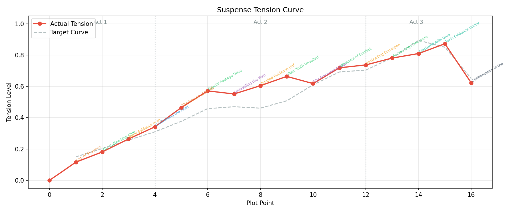

# Flying Panda

**Team:** Flying Panda (Arnav Mardia, Shivom Dhamija)  
**Template:** Template 1 - Suspense Murder Mystery

## Project Description

This pipeline generated murder mystery stories. The pipeline consist of a "ground-truth" crime whuch includes who did the crime, how, and what the motive was for the crime. The story includes 4 suspects with means, motive, and opportunity scores. The pipeline generates a chain of 6 clues that the detective must discover sequentially. To make teh story interesting, we have set up a way to induce red herrings that mislead the investigation. The pipeline ensures we have more than 15 plot points that drives the story and ensures there's enough suspense using a state machine that handles "tension" a metric we use to tune the suspense. The pipeline eventually generates a final story with a full reveal of the crime. 

The system uses GPT-4o-mini for narrative generation but controls pacing and structure through a non-LLM meta-controller that manages a target "tension" curve.

## Architecture

The pipeline has 5 stages:

1. **Crime Schema Generator** (`crime_schema.py`) - The LLM generates the ground truth: victim, criminal, suspects with key attributes, alibis, and an evidence chain.
2. **Red Herring Injector** (`red_herrings.py`) - The LLM generates misleading evidence that points towards innocent suspects. The true criminal's identity is removed from the prompt to prevent any bias.
3. **Suspense Meta-Controller** (`meta_controller.py`) - This is a state machine that decides what type of plot point happens next (clue discovery, red herrings, suspect confrontation, obstacles in investigation, etc) based on a target tension curve and the current investigation's progress.
4. **Plot Point Generator** (`plot_generator.py`) - The LLM writes each scene based on the meta-controller's specification, the crime schema, and a sliding context window of recent plot points.
5. **Story Compiler** (`story_compiler.py`) - The LLM takes all plot points and combines them into a cohesive story with transitions and ensures consistency across.

## How to Run

### Prerequisites

- Python 3.10+
- [uv](https://docs.astral.sh/uv/getting-started/installation/) (Python package manager)
- An OpenAI API key

### Setup

```bash
# Clone the repo
git clone <repo-url>
cd flying-panda

# Install dependencies
uv sync

# Set up your API key
cp .env.example .env
# Edit .env and paste your OpenAI API key
```

### Run

```bash

# Default setting (university research lab)
uv run python main.py

# Custom setting
uv run python main.py "a jazz club in Atlanta"
uv run python main.py "a tech startup in San Francisco"
```

### Output

The system creates 4 files in the `output/` directory:


| File                          | Description                                                                                |
| ----------------------------- | ------------------------------------------------------------------------------------------ |
| `mystery_TIMESTAMP.txt`       | The complete story with crime backstory, plot point summary table, and full compiled story |
| `crime_schema_TIMESTAMP.json` | The ground-truth crime schema with all suspect data, clues, and red herrings               |
| `plot_points_TIMESTAMP.json`  | Raw plot point data with event types, tension levels, and clue/herring tracking            |
| `tension_curve_TIMESTAMP.png` | Visualization of the target vs. actual tension curve across all plot points                |


## Expected Runtime and Cost


| Metric             | Value                                                                                                                |
| ------------------ | -------------------------------------------------------------------------------------------------------------------- |
| **Total runtime**  | 2-4 minutes per story                                                                                                |
| **API calls**      | ~22 calls to GPT-4o-mini (1 schema + 1 red herrings + 1 backstory + ~16 plot points + 1 compilation + 1 crime story) |
| **Estimated cost** | ~$0.03-0.08 per story (GPT-4o-mini pricing)                                                                          |


The meta-controller runs instantly with no API calls

## File Structure

```
flying-panda/
  main.py               # Entry point, orchestrates the full pipeline
  models.py             # Data classes (CrimeSchema, Suspect, Clue, PlotPoint, etc.)
  llm.py                # OpenAI API wrapper (call_llm, call_llm_json)
  crime_schema.py       # Stage 1: Crime Schema Generator
  red_herrings.py       # Stage 2: Red Herring Injector
  meta_controller.py    # Stage 3: Suspense Meta-Controller (no LLM)
  plot_generator.py     # Stage 4: Plot Point Generator
  story_compiler.py     # Stage 5: Story Compiler
  pyproject.toml        # Project config and dependencies for uv
  .env.example          # API key template
  examples/             # Exemplar and mis-spun story examples
```

## API Key

You can also export the key directly:

```bash
export OPENAI_API_KEY="sk-your-key-here"
uv run python main.py
```

## Exemplar Story

The full exemplar output is in `examples/exemplar_story.txt` with its corresponding crime schema, plot points JSON, and tension curve.

**Setting:** A university research lab
**Victim:** Dr. Emily Carter (biochemical engineering researcher)
**Criminal:** Dr. Michael Reynolds 
**Method:** Neurotoxin slipped into the victim's coffee

This story has 16 plot points covering all event categories:


| #   | Type                  | Title                              | Tension |
| --- | --------------------- | ---------------------------------- | ------- |
| 1   | obstacle              | Lab of Shadows                     | 0.12    |
| 2   | clue_discovery        | The Coffee Mug Clue                | 0.18    |
| 3   | red_herring_encounter | Eerie Evidence in the Lab          | 0.26    |
| 4   | suspect_confrontation | Confronting the Lead Researcher    | 0.34    |
| 5   | obstacle              | The Escape of Dr. Mitchell         | 0.46    |
| 6   | clue_discovery        | Crucial Footage Unveiled           | 0.57    |
| 7   | false_lead            | Unraveling the Web                 | 0.55    |
| 8   | red_herring_encounter | Tangled Evidence Unfolds           | 0.60    |
| 9   | clue_discovery        | Toxic Truth Unveiled               | 0.66    |
| 10  | false_lead            | The Fractured Evidence             | 0.62    |
| 11  | clue_discovery        | Whispers of Conflict               | 0.72    |
| 12  | red_herring_encounter | Misleading Correspondence Unveiled | 0.74    |
| 13  | clue_discovery        | Access Logs Uncovered              | 0.78    |
| 14  | breakthrough          | Fractured Alibi Unraveled          | 0.81    |
| 15  | breakthrough          | Toxic Evidence Uncovered           | 0.87    |
| 16  | resolution            | Confrontation in the Lab           | 0.62    |


### Tension Curve



The tension curve shows the 3-act structure: gradual build (0.12-0.34), rising action with dips for false leads (0.46-0.78), peak at breakthrough (0.87), and resolution drop (0.62).
